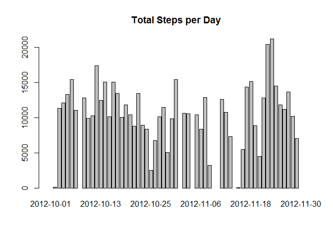
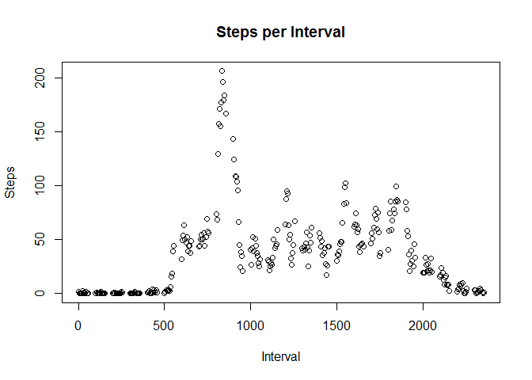
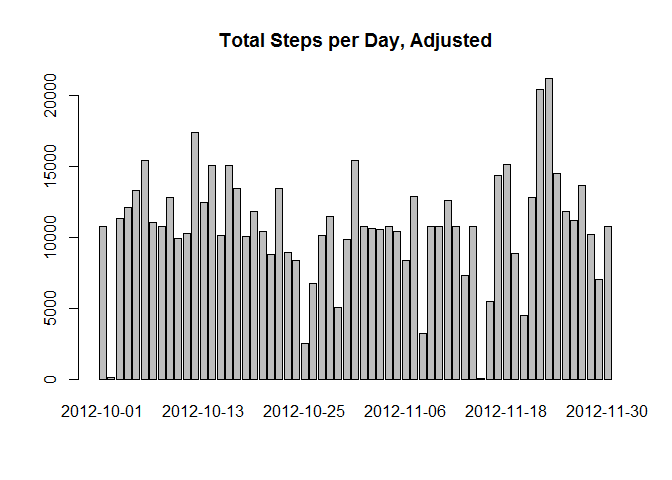
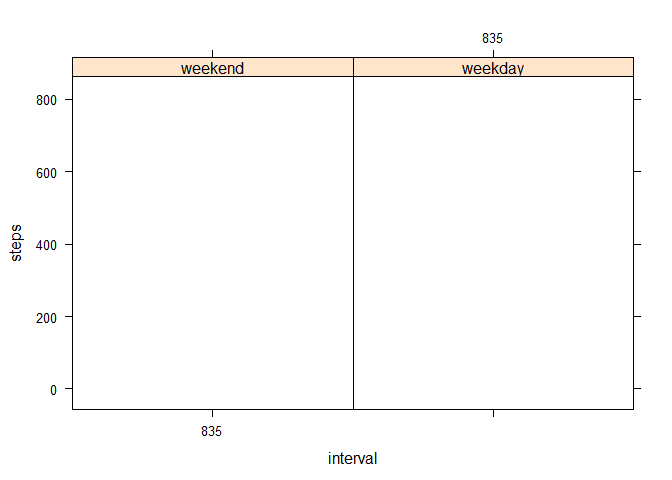

# Reproducible Research: Peer Assessment 1
Ilana Golbin  
#Activity Monitoring Data
Ilana Golbin

## Loading and preprocessing the data

```r
data<- read.csv("activity.csv")
```

## What is mean total number of steps taken per day?
 

The median steps is 10765 and mean steps is 1.0766189\times 10^{4}. 

## What is the average daily activity pattern?

 

The maximum steps occur in interval 835.


## Imputing missing values
 

The total number of missing values is: 2304. The updated mean is 1.0766189\times 10^{4} and updated median is 1.0766189\times 10^{4}.

## Are there differences in activity patterns between weekdays and weekends?


```
## The following objects are masked _by_ .GlobalEnv:
## 
##     date, fact, interval
```

 
